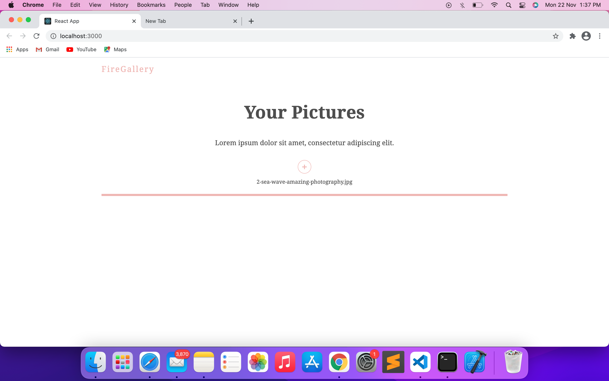
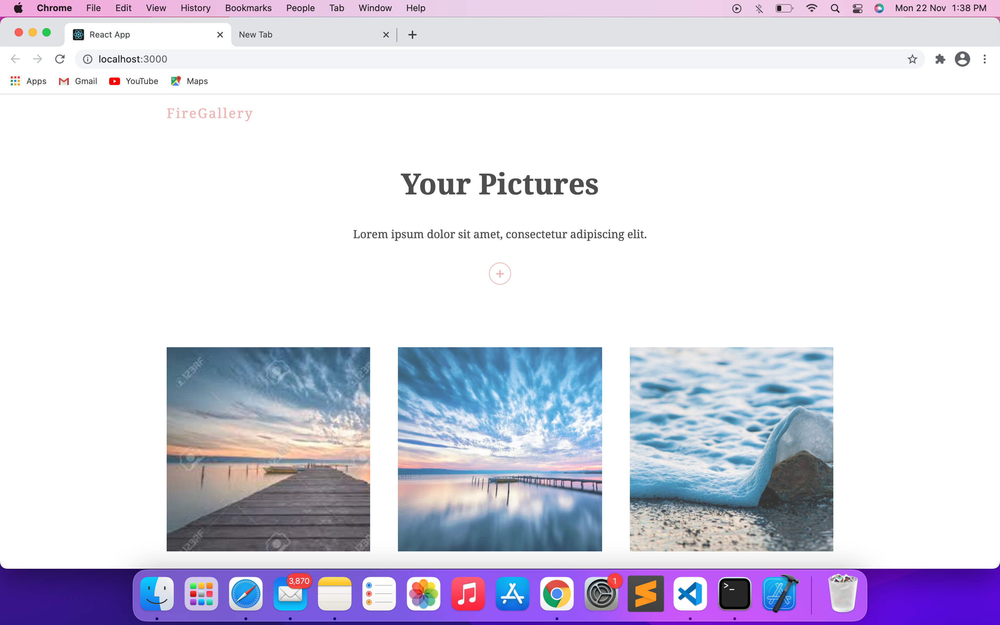
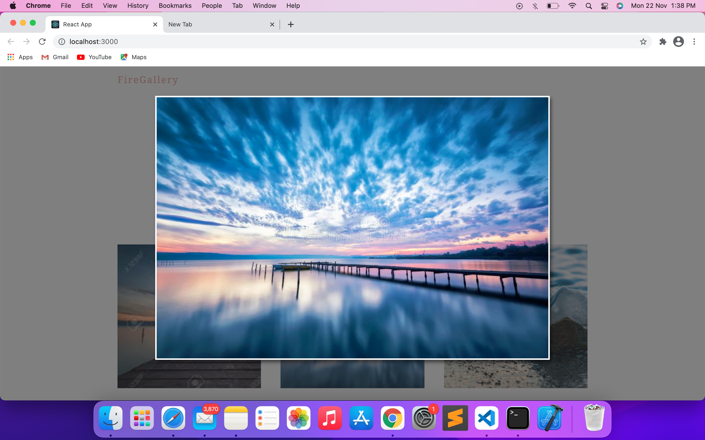

# Firegallery

<center>

[](https://www.python.org/)

[](https://github.com/sindresorhus/awesome#readme)

</center>

<hr>

## About

*__This a React based Image gallery. This is using Firebase in the backend, Firebase storage to store images and firstore to keep track of the images. This application also uses framer-motion library for fluid animations.__*


<hr>

## How to run

#### Setting up the environment

- Firebase project setup
    - Create an app on firebase
    - Setup firebase storage and firestore.
    - creacte a new file in the directory `src/Firebase/` named `config.js` and paste your firebase credentials there.
    *(PS: refer to the file `src/Firebase/example_config.js`*
        - ```
            # leave firebase_key as it is
            firebase_key=env/firebase_key.json
            firebase_route=<YOUR-FIREBASE-ROUTE>
            ```

### React App

- Run the command `npm install`  
*PS: Grab a cup of coffee, it takes some time to build*
- Now to run the application on local server, run `npm start`


- It will start the development server and voila you are good to go.  
  
  
  


<hr>

### Contributors
- [Dhruv-Sachdev1313](https://github.com/Dhruv-Sachdev1313)
- [Harshita-Kanal](https://github.com/Harshita-Kanal)
- [shintan777](https://github.com/shintan777/)
-  [ADI10HERO](https://github.com/adi10hero/)

<hr>

## Recognition
This repository/project is a submission to [DSC Solution Challenge 2021](https://developers.google.com/community/dsc-solution-challenge).

## References
- [Hospital Capacity and Availability Info](https://arogya.maharashtra.gov.in/pdf/Cat%20I%20Facility%2020%20March%202021.pdf) 
- List of Prominent Hospitals in Mumbai, i.e. Our [Hospital Dataset](https://arogya.maharashtra.gov.in/1166/List-of-Prominent-Hospitals-in-Mumbai?format=print)
- [Flutter App UI Motivation](https://github.com/mlayah/healthapp_ui)
- [Jinja Material Lite Wpx](https://appseed.us/jinja-template/jinja-template-material-lite)

<center>
<footer>
Made with ❤️ by Team <strong>Change Makers</strong>
</footer>
</center>